<p align="center">
  
</p>

<p align="center">
  
  
  
  
  
</p>

<p align="center">
  从零开始的 ROS 机器人开发完整学习路径<br/>
  环境搭建 → 通信机制 → 语音交互 → 导航定位 → 视觉识别
</p>

---

## 📖 课程导航

### 🟢 基础篇 — 搭建你的第一个 ROS 工程

| # | 主题 | 核心内容 | 笔记 |
|---|------|----------|------|
| 1 | 环境配置 | VMware + Ubuntu 虚拟机安装 | [📖 01-环境配置](./01-环境配置) |
| 2 | ROS 工程认知 | 工作空间、功能包、catkin 编译 | [📖 02-ROS工程认知](./02-ROS工程认知) |
| 3 | 节点编写 | Node、Master、roscpp、launch | [📖 03-ROS节点编写](./03-ROS节点编写) |

### 🟡 进阶篇 — 掌握 ROS 核心通信机制

| # | 主题 | 核心内容 | 笔记 |
|---|------|----------|------|
| 4 | 话题通讯 | Topic 发布/订阅、自定义消息 | [📖 04-ROS话题通讯](./04-ROS话题通讯) |
| 5 | 仿真环境 | Gazebo 仿真 + Rviz 可视化 | [📖 05-仿真机器人及环境](./05-仿真机器人及环境) |
| 6 | 服务通讯 | Service 请求/应答模型 | [📖 06-ROS服务](./06-ROS服务) |
| 6+ | 移动控制 | cmd_vel 话题控制机器人运动 | [📖 07-机器人移动控制](./07-机器人移动控制) |

### 🔴 实战篇 — 语音、导航、视觉

| # | 主题 | 核心内容 | 笔记 |
|---|------|----------|------|
| 8.1 | 语音采集 | 麦克风录音服务调用 | [📖 08-语音采集](./08-语音采集) |
| 8.2 | 语音听写 | 语音转文字（ASR） | [📖 09-语音听写](./09-语音听写) |
| 8.3 | 语义理解 | AIUI 意图识别与槽位提取 | [📖 10-语义理解](./10-语义理解) |
| 9 | 地图构建 | SLAM + gmapping 建图 | [📖 11-地图构建](./11-地图构建) |
| 10 | 自主导航 | Navigation Stack + 多点巡航 | [📖 12-自主导航](./12-自主导航) |
| 11 | 语音导航 | 语音指令 → 导航 → 语音播报 | [📖 13-语音导航](./13-语音导航) |
| 12 | 人脸识别 | dlib + ROS 服务封装 | [📖 14-人脸识别](./14-人脸识别) |
| — | 自主充电 | AR 码跟踪 + 二次定位 | [📖 15-机器人二次定位](./15-机器人二次定位) |

---

## 🗺️ 学习路线

```mermaid
%%{init: {'theme': 'base', 'themeVariables': {'fontSize': '12px', 'borderRadius': '20px', 'lineColor': '#90a4ae', 'arrowColor': '#90a4ae', 'primaryColor': '#e3f2fd', 'primaryTextColor': '#37474f', 'primaryBorderColor': '#90caf9'}}}%%
graph TD
    A["第1课 环境配置"] --> B["第2课 ROS工程认知"]
    B --> C["第3课 节点编写"]
    C --> D["第4课 话题通讯"]
    D --> E["第5课 仿真环境"]
    E --> F["第6课 服务通讯"]
    F --> G["第6+课 移动控制"]
    G --> H["第8课 语音交互"]
    H --> I["第9课 地图构建"]
    I --> J["第10课 自主导航"]
    J --> K["第11课 语音导航"]
    K --> L["第12课 人脸识别"]
    L --> M["自主充电"]

    style A fill:#e8f5e9,stroke:#c8e6c9,color:#2e7d32,stroke-width:1px
    style B fill:#e8f5e9,stroke:#c8e6c9,color:#2e7d32,stroke-width:1px
    style C fill:#e8f5e9,stroke:#c8e6c9,color:#2e7d32,stroke-width:1px
    style D fill:#fff8e1,stroke:#ffecb3,color:#f57f17,stroke-width:1px
    style E fill:#fff8e1,stroke:#ffecb3,color:#f57f17,stroke-width:1px
    style F fill:#fff8e1,stroke:#ffecb3,color:#f57f17,stroke-width:1px
    style G fill:#fff8e1,stroke:#ffecb3,color:#f57f17,stroke-width:1px
    style H fill:#fce4ec,stroke:#f8bbd0,color:#c62828,stroke-width:1px
    style I fill:#fce4ec,stroke:#f8bbd0,color:#c62828,stroke-width:1px
    style J fill:#fce4ec,stroke:#f8bbd0,color:#c62828,stroke-width:1px
    style K fill:#fce4ec,stroke:#f8bbd0,color:#c62828,stroke-width:1px
    style L fill:#fce4ec,stroke:#f8bbd0,color:#c62828,stroke-width:1px
    style M fill:#fce4ec,stroke:#f8bbd0,color:#c62828,stroke-width:1px

    linkStyle default stroke:#b0bec5,stroke-width:1px
```



---

## ⚡ 快速参考

<details>
<summary>🔧 ROS 常用命令速查</summary>

| 命令 | 用途 |
|------|------|
| `roscore` | 启动 Master |
| `rosrun <pkg> <node>` | 运行节点 |
| `roslaunch <pkg> <file.launch>` | 批量启动 |
| `rostopic list` | 列出话题 |
| `rostopic echo /topic` | 打印话题数据 |
| `rosservice list` | 列出服务 |
| `rosservice call /srv args` | 调用服务 |
| `rosnode list` | 列出节点 |
| `rqt_graph` | 节点通信可视化 |
| `rosmsg show <type>` | 消息结构 |
| `rosrun tf tf_echo /f1 /f2` | 坐标变换 |

</details>

<details>
<summary>📦 标准开发流程</summary>

```
1. catkin_create_pkg <name> <deps>   # 创建功能包
2. 编写源码 src/xxx.cpp               # 写代码
3. 修改 CMakeLists.txt                # add_executable + target_link_libraries
4. catkin_make                        # 编译
5. source devel/setup.bash            # 刷新环境
6. roslaunch / rosrun                 # 启动
```

</details>

<details>
<summary>⚖️ Topic vs Service 对比</summary>

| 特性 | Topic | Service |
|------|-------|---------|
| 通信方式 | 异步单向 | 同步双向 |
| 模式 | 发布/订阅 | 请求/应答 |
| 适用场景 | 周期性数据 | 按需查询 |
| 资源占用 | 持续传输 | 按需调用 |
| 类比 | 广播 | 打电话 |

</details>

---

## 📚 参考资源

- [ROS Wiki](http://wiki.ros.org/) — 官方文档
- [Navigation Stack](https://github.com/ros-planning/navigation) — 导航功能包源码
- [Gmapping](http://wiki.ros.org/gmapping) — SLAM 算法文档
- [face_recognition](https://github.com/ageitgey/face_recognition) — 人脸识别库

---

<p align="center">
  📝 整理自 ROS 机器人课程 · ROS Melodic + Ubuntu 18.04
</p>
